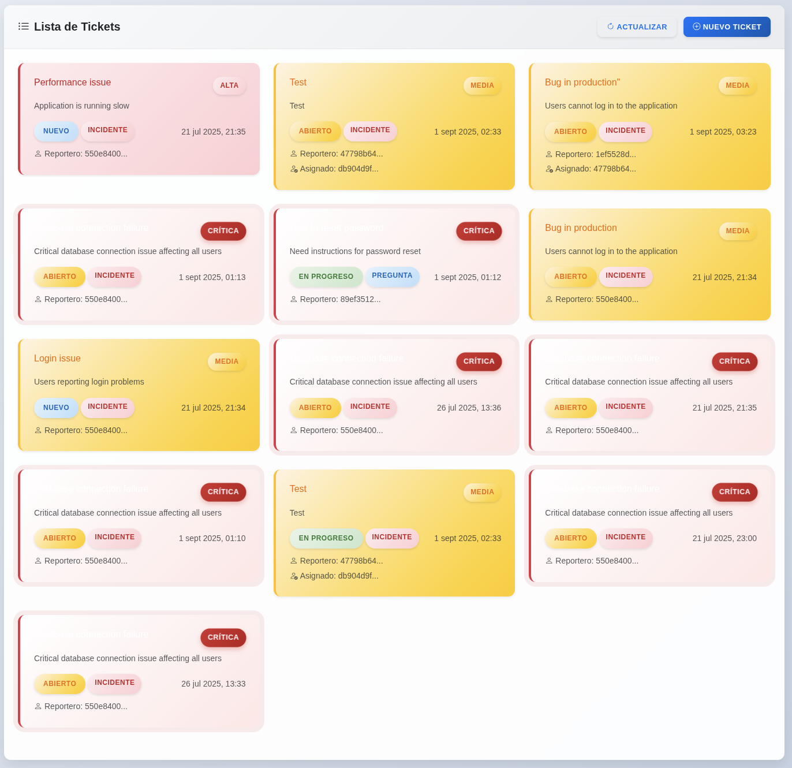

# Ticket System - Demo Frontend

This repository is a modern and responsive frontend for testing the serverless ticket management system built on Amazon Web Services (AWS). This frontend demo is designed to work seamlessly with the backend's evolutionary monorepo approach, providing a comprehensive interface for ticket management operations.

## 🚀 Features

- **Modern Interface**: Clean and professional design with Bootstrap 5
- **Fully Responsive**: Works perfectly on desktop, tablet, and mobile
- **Complete Ticket Management**: Full CRUD operations for tickets (Create, Read, Update, Delete)
- **AWS Cognito Integration**: Seamless authentication with automatic JWT token generation
- **API Key Support**: Flexible authentication with x-api-key header support
- **Error Handling**: Clear notifications and robust error handling
- **Configuration Management**: Easy setup of API endpoints and security parameters
- **Lightweight Architecture**: No heavy frameworks, optimized for performance

## 📸 Screenshots

### Main Dashboard

*Main ticket list view with responsive design*

### Ticket Creation

*Form for creating new tickets with validation*

### Ticket List

*Ticket list view*

### Ticket Details

*Detailed view of a specific ticket*

### Security Configuration

*Security parameters section with JWT and API key configuration*


## 🛠️ Tech Stack

- **HTML5**: Semantic and accessible structure
- **CSS3**: Modern styles with CSS variables and animations
- **JavaScript ES6+**: Modern code with classes and async/await
- **Bootstrap 5**: CSS framework for quick and professional UI
- **Axios**: HTTP client for API requests
- **Bootstrap Icons**: Consistent and modern iconography

## 📋 Functionality

### Ticket Management
- ✅ **List Tickets**: Card view with summarized information
- ✅ **Create Tickets**: Complete form with validation
- ✅ **View Details**: Detailed view of each ticket
- ✅ **Edit Tickets**: Complete ticket updates
- ✅ **Delete Tickets**: Confirmation before deletion

### Configuration
- ✅ **Configurable Base URL**: Easy API endpoint changes
- ✅ **JWT Authentication**: Bearer token configuration
- ✅ **Connection Test**: API connectivity verification
- ✅ **Persistence**: Configuration saved in localStorage

### UX/UI
- ✅ **Responsive Design**: Adaptable to any device
- ✅ **Loading States**: Visual indicators during operations
- ✅ **Notifications**: Toast notifications for feedback
- ✅ **Validation**: Real-time form validation
- ✅ **Intuitive Navigation**: Clear navigation between views

## 🔐 Security Features

### Authentication Options
- **JWT Bearer Token**: Manual token configuration
- **API Key**: Manual API key configuration (sent as `x-api-key` header)
- **Amazon Cognito Integration**: Automatic JWT generation through Cognito login

### Cognito Login
The application includes built-in support for Amazon Cognito authentication:
- Configure your Cognito region, client ID, username, and password
- Click "Iniciar sesión" to automatically authenticate and generate JWT tokens
- JWT tokens are automatically applied and stored for API requests

## 🚀 Installation and Usage

### 1. Clone or Download
```bash
git clone <your-repository>
cd ticket-system-ui-demo
```

### 2. Configure the API
1. Open `index.html` in your browser
2. In the "API Configuration" section, enter your API Gateway base URL
3. Configure your JWT token if necessary
4. Set your API key if required
5. Click "Test Connection" to verify connectivity

### 3. Use the Application
- **View Tickets**: The main view shows all tickets
- **Create Ticket**: Use the "New Ticket" button to create a new one
- **View Details**: Click on any ticket to see its details
- **Edit**: From the details view, use the "Edit" button
- **Delete**: From the details view, use the "Delete" button

## 🔧 API Configuration

### Base URL
The base URL should point to your AWS API Gateway endpoint. Example:
```
https://abc123def4.execute-api.us-east-1.amazonaws.com/prod
```

### Authentication Options
The frontend supports multiple authentication methods that align with the backend's security implementation:

**AWS Cognito Integration:**
1. Configure your Cognito region, client ID, username, and password
2. Click "Iniciar sesión" to automatically authenticate and generate JWT tokens
3. JWT tokens are automatically applied and stored for API requests

**Manual JWT Token:**
1. Obtain your JWT token from the authentication system
2. Paste it in the "JWT Token" field in the security section
3. Click the key button to configure it

**API Key Authentication:**
1. Enter your API key in the "API Key" field
2. Click "Configurar" to set it
3. The key will be automatically sent as `x-api-key` header in all requests

### Supported Endpoints
The application is designed to work with the backend's serverless monolith architecture, which provides the following RESTful endpoints through the `manage-tickets` Lambda function:

- `GET /v1/tickets` - List all tickets from DynamoDB
- `POST /v1/tickets` - Create a new ticket in DynamoDB
- `GET /v1/tickets/{id}` - Retrieve a specific ticket by ID
- `PUT /v1/tickets/{id}` - Update a ticket completely
- `PATCH /v1/tickets/{id}` - Update a ticket partially
- `DELETE /v1/tickets/{id}` - Delete a ticket from DynamoDB

## 🔗 Backend Repository

This frontend demo is designed to work with the backend serverless ticket management system available at:
**https://github.com/luisguisadocloud/aws-serverless-ticket-system**

The backend implements a serverless ticket management system on AWS using an evolutionary monorepo approach. It starts as a serverless monolith with a single Lambda function (`manage-tickets`) handling all CRUD operations, and is designed to incrementally transform towards a logical microservices architecture.

**Backend Architecture:**
- **Serverless Monolith**: Single Lambda function for all ticket operations
- **Data Storage**: DynamoDB table for ticket persistence
- **Authentication**: Progressive integration with AWS Cognito
- **API Gateway**: HTTP routing and request handling
- **Infrastructure as Code**: Terraform-managed infrastructure with well-defined modules
- **Evolutionary Design**: Gradual transition from monolith to microservices

## 📱 Responsive Design

The application is optimized for:
- **Desktop**: Full view with multiple columns
- **Tablet**: Adapted layout with collapsible navigation
- **Mobile**: Single column view with touch controls

## 🎨 Customization

### Colors and Themes
Colors are defined in CSS variables in `styles.css`:
```css
:root {
    --primary-color: #0d6efd;
    --success-color: #198754;
    --danger-color: #dc3545;
    /* ... more colors */
}
```

### Ticket Styles
Tickets are displayed with color codes according to their priority:
- **Low**: Blue
- **Medium**: Yellow
- **High**: Red
- **Critical**: Red with pulse animation

## 🔍 Debugging

### Development Tools
1. Open developer tools (F12)
2. Go to the "Network" tab to see HTTP requests
3. Go to the "Console" tab to see logs and errors

### Application Logs
The application logs useful information in the console:
- Loaded configuration
- API errors
- Operation status

## 🚨 Troubleshooting

### CORS Error
If you encounter CORS errors, make sure your API Gateway has configured:
- Appropriate CORS headers
- Allowed HTTP methods
- Allowed origins

### 401 Error (Unauthorized)
- Verify that the JWT token is valid
- Make sure the token hasn't expired
- Confirm that the token format is correct

### 404 Error (Not Found)
- Verify that the base URL is correct
- Confirm that the endpoint exists in your API
- Check that the API version is correct (v1)

## 📄 Project Structure

```
ticket-system-ui-demo/
├── index.html          # Main page
├── styles.css          # Custom styles
├── script.js           # Application logic
├── openapi/            # OpenAPI specification
│   └── api.yaml       # API documentation
├── screenshots/        # Application screenshots
│   ├── main-dashboard.png
│   ├── create-ticket.png
│   ├── ticket-details.png
│   ├── security-settings.png
│   └── cognito-login.png
├── LICENSE             # MIT License
└── README.md           # This file
```

## 🤝 Contributing

1. Fork the project
2. Create a branch for your feature (`git checkout -b feature/AmazingFeature`)
3. Commit your changes (`git commit -m 'Add some AmazingFeature'`)
4. Push to the branch (`git push origin feature/AmazingFeature`)
5. Open a Pull Request

## 📝 License

This project is licensed under the MIT License. See the [LICENSE](LICENSE) file for details.

## 📞 Support

If you have questions or need help:
- Open an issue on GitHub
- Contact the developer: lguisadom@gmail.com
- Visit the blog: https://blog.luisguisado.cloud

---

**Enjoy testing your ticket system! 🎫**